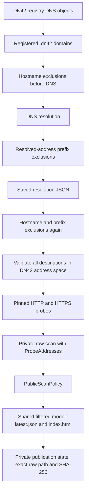
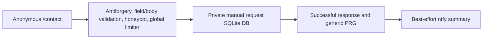

# DN42Atlas Architecture

This guide describes the code and the current Linux deployment model. The root
[README](../README.md) is the quick overview; the [OptOut README](../DN42Atlas.OptOut/README.md)
contains detailed configuration and recovery instructions. Deployment settings
described here are not an nginx configuration or OptOut systemd unit supplied by this repository.
Opt-in crawler service/timer templates are provided under `deployment/systemd/`.

## Goals and non-goals

Atlas discovers limited public metadata about DN42 services. Probing is HTTP/HTTPS
only, from registered `.dn42` hostnames, with approved DN42 destinations. It is not
a vulnerability scanner: there is no exploit testing, authentication attempt,
path brute force, or recursive following of discovered links.

Exclusion and privacy safety fail closed. A crawler must not quietly omit missing
policy. Historical raw scans are immutable evidence; public JSON and HTML are
derived views that can be rebuilt under current exclusions. Publishing never
consults current DNS to invent historical destinations.

The live site is still a private preview. Public listings will not launch before
October 16, 2026. Artifact generation does not enforce a calendar gate: deployment
must keep the source preview root separate from generated listings until launch.

## Major components

### DN42Atlas

| Component | Responsibility |
| --- | --- |
| `Program.cs`, `Commands/` | CLI dispatch, usage/exit codes, source selection and output orchestration; `run`, `republish`, `publish-existing` and `registry-update` |
| `Registry/` | Registry object parsing, resolution/probe models, Git snapshot inspection, observation metadata and explicit registry updates |
| `Scanning/` | Live registry resolution and saved-resolution filtering; `WebScanner` coordinates probes with concurrency 32 |
| `Networking/` | DN42 address-space guard, normalized approved destinations, connections pinned to saved IPs while retaining Host/TLS SNI |
| `Probing/` | Existing HTTP target list, bounded HTTP requests, robots evaluation, homepage metadata and link extraction |
| `Policy/` | Required manual/runtime exclusion loading, hostname/CIDR matching and public-model filtering/redaction |
| `Reporting/` | Self-contained HTML viewer, safe JSON embedding and navigation/filter UI |
| `Publishing/` | Shared filtered model generation, staged stable artifacts, exact private publication state and raw-scan hash verification |

Commands own filenames and summaries; scanning services return data. Networking
does not delegate destination choice back to DNS during HTTP probing and disables
ambient proxies. `HttpProber` retains protocol behavior; recorded links do not
authorize probes of additional hosts or protocols.

### DN42Atlas.OptOut

| Component | Responsibility |
| --- | --- |
| `Auth/` | Parse/reduce Auth42 identity into the local cookie principal |
| `Registry/` | Canonical exact-domain/allocation catalogs and `mnt-by` ownership checks against a Fresh snapshot |
| `Exclusions/` | Private SQLite audit storage, protected mutation coordination, runtime materialization, republish and recovery |
| `ManualRequests/` | Independent private request database, validation, global rate limiter and operator CLI management |
| `Web/` | Server-rendered `/operator` and `/contact`, antiforgery validation, protected confirmation tokens and status pages |
| `Program.cs` | Maintenance command dispatch before web-only configuration, then authentication, DI and route setup |

`external/JoyfulReaperLib` is a pinned Git submodule. OptOut references only
`JoyfulReaperLib.Ntfy` by ProjectReference and calls `INtfyPublisher` using the
library's standard `Ntfy` configuration and startup validation. Clean clones
require `git submodule update --init --recursive`; there is no sibling checkout
dependency or copied notification HTTP client.

## End-to-end crawl flow



The live resolver checks hostname rules before DNS and rejects any excluded
resolved address. The DN42 address-space guard runs before service probing, not
as a filter on the resolver's saved JSON. Saved-resolution scans also reject
invalid/non-`.dn42` names, unsafe/mixed address sets and conflicting duplicate
rows. Any excluded address skips the entire domain before HTTP requests.

Each origin first requests `/robots.txt`. Homepage `/` is fetched only when the
robots policy permits it or the robots file is absent. Unavailable, redirected,
malformed or truncated robots responses do not permit homepage fetching.
Redirects are recorded without automatic following. Robots prevents page-content
fetching; it does not prevent the robots request, reachability metadata, or listing.
Complete exclusion prevents probing entirely.

`run` resolves, scans, generates the adjacent historical HTML report, then publishes
stable derived artifacts. Standalone `web-scan` and `report` do not publish. DNS and
unreachable-origin failures are recorded outcomes; a failed stage stops the pipeline.

## Publication model

`results/` is private historical storage: timestamped raw JSON and adjacent reports.
Never expose it as a static web root. Raw results retain `ProbeAddresses`, the
complete normalized, deduplicated and ordered approved scan-time destination set,
including for failed probes. It is not evidence of which one address connected.

`PublicArtifactGenerator` parses a fresh model and applies `PublicScanPolicy` once.
A hostname exclusion or any excluded recorded destination removes the whole result.
References are filtered/redacted; public exclusion information contains counts,
not the matched rules. After row decisions, retained `ProbeAddresses` is removed.
Hostnames removed by recorded prefix matches also become known-excluded exact
hostnames for secondary metadata filtering, using the same case/trailing-dot
normalization as hostname policy. This uses raw evidence without DNS lookups.
`published/latest.json` and the self-contained `published/index.html` serialize the
same filtered model with safe encoding. Raw bytes and original scan time do not change.

Private publication state records an absolute raw path, version, publication UTC
time and SHA-256. `republish` accepts only that selection and verifies its hash.
`publish-existing <raw-scan.json>` deliberately selects one existing raw file;
there is no latest-file search or inference from mtimes. Both commands perform no
registry resolution, DNS lookup or HTTP probing. Public artifacts cannot substitute
for provenance-bearing raw snapshots.

Legacy scans remain usable without prefix policy, including hostname-only policy.
Under any active prefix exclusion, each retained result needs nonempty valid
destination provenance. Insufficient evidence fails closed and withdraws both
stable listing files where possible. Support pages and private publication state
are preserved. A new provenance-aware crawl is needed; reconciliation never
retrofits old raw scans or resolves current DNS to guess old addresses.

Stable files are staged beside their destinations, flushed/closed, then individually
renamed. Generation/staging failures preserve previous files; privacy failures
withdraw listings. Replacing JSON, HTML and then private state is **not one transaction**:
a crash between replacements can leave a mismatched pair or old state. Investigate
failures before retrying and coordinate all publishers. Installed support files
(`about.html`, `opt-out.html`, `robots.txt`) are created only when absent; other
operator pages/assets are preserved. Source preview pages are a separate web root.

## Exclusion architecture

| Layer | Example path | Role |
| --- | --- | --- |
| Manual hosts | `config/excluded-hosts.txt` | Exact hostnames and wildcard descendants |
| Manual prefixes | `config/excluded-prefixes.txt` | IPv4/IPv6 CIDRs |
| Runtime | `/var/lib/dn42atlas/runtime-exclusions.json` | Active exact self-service hosts/CIDRs materialized for crawler policy |
| Audit | `/var/lib/dn42atlas/exclusions.db` | Private identities, registry evidence, resource records and revocations |

Both manual files are required even when empty. Wildcards do not cover the bare
parent. Manual policy wins and cannot be revoked through self-service. If runtime
policy is configured it is also required and validated; the crawler never reads
the audit database. Without runtime configuration the CLI remains manual-only.

Auth42 supplies identity, not resource authorization. The local canonical registry
must show the exact domain or allocation's `mnt-by` matching the authenticated
active maintainer. Self-service excludes exact registered resources only, not
wildcards, delegated domains, ASN-wide policy or unregistered broader/narrower ranges.

Freshness derives from clean Git state and observed commit/time metadata from
`registry-update`, not the age of arbitrary files. Default maximum age is 72 hours.
Stale, dirty or unknown snapshots disable mutation approval. A dedicated registry
checkout is required because the explicit updater fetches/prunes and hard-resets
to its configured upstream. No web request fetches registry data.

Confirmation and final POSTs validate antiforgery and resource/identity constraints.
Data Protection encrypts/authenticates a five-minute token binding operation,
normalized resource, subject and maintainer. Inclusion binds the active exclusion
ID; exclusion binds the latest historical ID (or null). Final POST obtains a new
Fresh snapshot and rechecks ownership inside the mutation gate. Tokens are not
authorization. Active exclusion replay is idempotent; an intervening exclude/include
generation invalidates old exclusion confirmations. Raw IDs are not browser authority.

```mermaid
sequenceDiagram
  actor Operator
  participant Web as OptOut
  participant Registry as Local registry
  participant DB as Private audit DB
  participant Policy as Runtime policy
  participant Publisher
  Operator->>Web: Confirm exact exclusion (antiforgery)
  Web->>Registry: Freshness and current mnt-by check
  Web-->>Operator: Protected confirmation; no mutation
  Operator->>Web: Final exclusion with protected token
  Web->>Registry: Repeat checks under mutation gate
  Web->>Web: Flush private pending fence
  Web->>Publisher: Withdraw both stable listing files before DB commit
  Web->>Policy: Move old runtime aside (crawler fence)
  Web->>DB: Record active exclusion
  Web->>Policy: Materialize and validate all active records
  Web->>Publisher: Re-filter state-recorded immutable raw scan
  Web-->>Operator: Success or explicit partial-failure status
```

Exclusion removes current published data and blocks future probing. Runtime is
moved aside before critical writes so newly started crawlers fail closed.
Before a restrictive commit, a private fence at
`<DN42ATLAS_RUNTIME_EXCLUSIONS_PATH>.reconciliation-pending` is flushed and both
stable listing files are removed. Failure to fence/withdraw prevents the commit.
The fence remains through materialization and publication, and is removed only
after successful full reconciliation. Web startup detects it before runtime
validation, withdraws any listing, and reconciles SQLite's authoritative state;
failed recovery refuses startup. The reserved fence path must remain private and
writable, separate from raw scans and other state. No schema/config migration is needed.
If reconciliation fails, recorded exclusions remain effective/authoritative and
the listing is withdrawn where possible. Never reinstall an old policy backup
over newly recorded audit state.

**Include again** revokes only an active self-service record. Current authorized
ownership can revoke an earlier owner's record. Manual rules still block inclusion.
The coordinator creates a candidate runtime bundle, republishes historical data,
then installs policy. Failure attempts to restore that exact audit row and filtered
publication; unverifiable recovery withdraws runtime/listings and needs intervention.
Critical mutation/recovery continues after client disconnect. Process termination
is not an atomic DB/filesystem transaction.

`exclusions-reconcile` rebuilds from recorded active rows and republishes the exact
state-selected scan without crawling; `exclusions-materialize` only rebuilds runtime.
The local mutation gate is supplemented by a cross-process operation lock at
`<publication-state-path>.operation-lock`, outside the public root. Linux uses an
explicitly checked exclusive nonblocking `flock`; Windows uses exclusive file
sharing. The permanent file uses `0600` on Unix; ownership ends on descriptor
disposal/process death. Do not unlink/replace it or alias paths.
Publishing CLI commands `run`, `republish`, `publish-existing` acquire before
loading policy and hold ownership for the whole operation. Final mutations,
rollback, maintenance reconciliation and startup recovery participate; internal
reconciliation receives the owned lease to avoid nested acquisition. Runtime
initialization/materialization CLI also lock. Web mutations return 503/retry
guidance after bounded local/OS waits without changes; CLI/startup wait longer.
Use identical configured state/policy/public paths and one mutation web process.
Standalone resolution/scanning/report/probe commands do not publish and do not lock.
Registry updates remain separately coordinated; the publication lock does not
replace the registry updater's own lock or make DB/filesystem updates transactional.

Scheduled production `run` uses `DN42ATLAS_REGISTRY_PATH` as a checkout root,
reading `data/dns`, matching registry-update and OptOut. Explicit resolver
constructor paths override configuration; unset settings retain the developer
home-directory fallback. `deployment/systemd/` supplies a oneshot source-checkout
run at 01:30 local time daily, persistent with up to 15 minutes random delay, and
a 45-minute maximum runtime. Its separate `crawler.env` contains only registry,
runtime and publication-state paths. Templates are opt-in, not installed by code;
nginx continues serving the preview root until the October 16 launch gate.

## Manual request architecture



The database is authoritative; ntfy is notification, not persistence. Required
Resource/Contact are at most 255 characters; Message at most 2000; RequestType
uses an exact five-value allowlist while the form displays friendly labels.
The form accepts only bounded UTF-8 urlencoded requests with exact fields, trims
values and rejects inappropriate controls. No attachments, URL fetching or
submitted HTML rendering is supported. A filled honeypot receives generic success
without persistence. No request data or IDs enter redirect URLs.

The separate initialized database stores Pending requests, nullable ReviewedUtc
and private full messages. ntfy receives only type/resource/contact/id, High priority
and `dn42`/`atlas` tags. Notification follows durable persistence and response
completion. Failure logs a warning without undoing the record, failing the user
response, or retrying. A crash can leave a saved request without notification.

The contact limit is ten POST attempts per minute, shared across clients in one
process, including invalid requests. It ignores caller-provided forwarded addresses.
It resets on restart and is not coordinated across instances. There is no durable
ntfy retry queue or private HTTP request-admin interface.

The CLI and `dn42atlas-request-admin` are private operator tooling. Lists omit
Message; detail includes it. Status transitions out of Pending set ReviewedUtc;
changes between reviewed states preserve it; Pending clears it. Deletion affects
only that manual record. Neither submissions nor management authorize, create,
broaden, or revoke exclusions, change policy/state, or publish artifacts.

## Authentication and trust boundaries

Auth42 OIDC uses authorization code/PKCE. Claims are parsed and reduced into a
local cookie principal; access tokens are not saved. The authenticated subject,
active maintainer and ASN do not override registry ownership. Secure cookies,
antiforgery pairs and protected confirmations defend mutations; rendered values
are encoded and private response pages use `no-store`.

In the deployed topology nginx terminates HTTPS and selected dynamic routes
reach the application only on `127.0.0.1:5078`. That binding is deployment
configuration (for example ASPNETCORE_URLS), not hard-coded by Program.cs.
Forwarded headers use ASP.NET Core's trusted-local-proxy defaults; do not broadly
trust arbitrary proxies or expose the backend publicly. Static listing content
must never make private databases, raw scans, runtime rules or state reachable.

Data Protection is registered through framework services using default storage
behavior, not a custom repository key configuration. The Linux deployment should
retain the service account's writable `~/.aspnet/DataProtection-Keys` across releases
and protect it as private state. Do not assume release-local keys are persistent.
Cookie/token continuity also depends on the application's Data Protection identity;
changing deployment content roots/identity may invalidate old cookies or tokens.
No credentials or private topic values belong in documentation or Git.

## Persistent state / filesystem layout

These are conceptual deployment paths, not universal CLI defaults:

| Path | Classification and lifetime |
| --- | --- |
| `/opt/DN42Atlas` | Source/config checkout, scripts and submodule |
| `/opt/DN42Atlas/DN42Atlas/site` | Public source preview pages; launch gate stays in place |
| `/opt/DN42Atlas/config` | Source/operator configuration; manual host/prefix rules, not served |
| `/opt/DN42Atlas/results` | Private raw data and historical HTML; retained independently of releases |
| `/opt/DN42Atlas/published` | Public/derived artifacts; not the current preview root |
| `/opt/dn42atlas-optout/releases` | Replaceable published application binaries, not crawler artifacts/state |
| `/opt/dn42atlas-optout/current` | Active release symlink used by systemd |
| `/var/lib/dn42atlas/registry` | Private persistent dedicated authorization snapshot |
| `/var/lib/dn42atlas/exclusions.db` | Private persistent audit database |
| `/var/lib/dn42atlas/manual-requests.db` | Private persistent request database |
| `/var/lib/dn42atlas/runtime-exclusions.json` | Private persistent active policy consumed by crawler/report commands |
| `/var/lib/dn42atlas/publication-state.json` | Private persistent source selection and required raw SHA-256 |
| `~/.aspnet/DataProtection-Keys` | Private persistent service-account encryption keys, framework defaults |
| `~/.config/dn42atlas/oidc.env` | Secret configuration; trusted shell env file for admin helper/deployment configuration |

OptOut requires explicit absolute private/public paths and validates separation.
Do not use aliases or links into a served directory. PrivateFile creates new
databases/runtime/state files with owner read/write (`0600`) on Unix; existing
permissions and Windows ACLs are not rewritten. Protect parent directories and
ensure the intended crawler/service account can read policy/state.

Core CLI loads manual rules, `results/` and `published/` under its working directory.
`DN42ATLAS_REGISTRY_PATH` is the checkout root shared by resolution, registry update
and OptOut authorization; absent configuration retains `~/dn42-registry/data/dns`.
`DN42ATLAS_PUBLICATION_STATE_PATH` can
override the CLI's private `.dn42atlas/publication-state.json` default;
OptOut requires an explicit state path. The web service's published-path setting
does not change the crawler's working-directory published root.

## Deployment architecture

```mermaid
flowchart TD
  Browser --> Nginx[nginx HTTPS]
  Nginx --> Static[Source preview now; derived public artifacts only after launch]
  Nginx --> Dynamic[Selected routes to 127.0.0.1:5078]
  Dynamic --> Service[systemd dn42atlas-optout.service]
  Service --> Current[/opt/dn42atlas-optout/current]
  Current --> Release[Timestamped release / DN42Atlas.OptOut.dll]
```

Selected routes are `/operator`, `/login`, `/logout`, `/signin-oidc`, `/contact`.
The systemd command is `/usr/bin/dotnet /opt/dn42atlas-optout/current/DN42Atlas.OptOut.dll`.
Units and nginx configuration are managed outside this change/repository.

`deploy-optout.sh` runs as a non-root deployment account with release-directory
write access and suitable sudo permissions for systemctl. It refuses dirty Git,
pulls `--ff-only`, syncs/updates the pinned submodule, publishes Release, atomically
replaces the current symlink, restarts an installed service and verifies active
state. This is a systemd check, not HTTP readiness validation. Without an installed
service it skips restart. It does not source the OIDC env file or migrate private
databases, change proxy/unit configuration, deploy preview pages, or launch listings.

After successful activation/check, pruning keeps current explicitly and the newest
three other completed releases by descending name. `DN42ATLAS_OPTOUT_RETAIN_PREVIOUS`
accepts non-negative integers: zero means current only. An older current is still
preserved. Only real direct directories with `<UTC timestamp>-<hex SHA>` names
qualify; unrelated directories, symlinks and hidden temps do not. Unsafe current
targets refuse pruning. Pruning errors return nonzero but do not roll back the
active deployment. Failed publication/activation cleans only that invocation's
owned temp directory/link; restart failure leaves old releases untouched and does
not automatically roll back the newly activated current.

Source code changes alone do not update the running OptOut binary. Deploy them.
Source preview edits can change served static pages when that directory is the
configured web root. Generated support copies remain protected from overwrite.

## Failure behavior / fail-closed decisions

| Failure | Behavior |
| --- | --- |
| Missing manual host/prefix file or malformed CIDR | Stop configured crawler/report work before network activity |
| Configured runtime bundle missing/malformed | Stop crawler/report work; web mutation startup also validates it |
| Unsafe/mixed probe destinations or invalid `.dn42` name | Skip target before probing |
| Stale/dirty/unknown registry | Reject automatic exclusion/inclusion approval; existing exclusions remain |
| Missing/invalid prefix provenance | Fail publication and withdraw stable listing where possible; preserve raw evidence and recorded exclusions |
| Ordinary generation/staging failure | Preserve previous artifacts; mutation/reconciliation may instead withdraw listing to prevent stale exclusions |
| Replacement failure/crash | Possible partial filesystem state; report failure and investigate/reconcile |
| Exclusion runtime/republish failure after recording | Keep recorded exclusion; fence runtime or withdraw listing as needed; explicit partial-failure response |
| Inclusion failure | Restore exact original row/policy/publication where provable; otherwise withdraw and require reconciliation |
| ntfy failure | Preserve submitted request and user success; warning only, no retry |
| Missing/manual request DB with invalid schema | Web startup fails; no silent initialization; persistence failure cannot return submission success |
| Invalid OIDC identity or missing authentication | No authorized mutation; signed-out page offers login; OIDC failures do not grant ownership |
| Invalid antiforgery/confirmation | Reject mutation/submission without writes |
| Deployment publish/restart failure | No pruning; owned temp cleanup; activated release may require explicit rollback |

Withdrawal can itself fail due to permissions. That is an operational failure
requiring immediate intervention, not proof that public data was removed.

## Operational commands

Use the root README for full crawler syntax and the OptOut README for settings.

| Executable/tool | Commands |
| --- | --- |
| `dotnet run --project DN42Atlas --` | `run`, `republish`, `publish-existing <raw-scan.json>` |
| Same crawler executable | `registry-update` against a dedicated configured checkout/upstream |
| `dotnet run --project DN42Atlas.OptOut --` | `exclusions-init`, `exclusions-materialize`, `exclusions-reconcile` |
| Same OptOut executable | `manual-requests-init`, `manual-requests`, `manual-request <id>` |
| Same OptOut executable | `manual-request-status <id> <Pending|Reviewed|Resolved|Rejected>`, `manual-request-delete <id>` |
| `./dn42atlas-request-admin [env-file]` | Interactive private review; exact DELETE confirmation |
| `./deploy-optout.sh` | Release deployment, service restart/check and retention |

## Known limitations / future work

- JSON/HTML/private state and SQLite/runtime reconciliation are not one transaction.
- Contact rate limiting is process-local; mutation/publication locking is cross-process.
- Notifications have no durable queue/retry; SQLite is the review source of truth.
- Self-service supports exact resources only; wildcard/broader cases require manual review.
- Full `run` defers mutations until completion; standalone scans need separate coordination.
- Core CLI working-directory defaults differ from web explicit path configuration.
- There is no pipeline-wide cancellation or automatic public launch gate; scheduling uses opt-in systemd templates.
- Second-resolution scan filenames can collide under concurrent standalone scans; full `run` serializes.
- Public artifacts omit provenance and cannot replace immutable raw scans.
- Release retention has no cross-process deployment lock; deploy one process at a time.
- Service active-state verification is not an HTTP probe or automatic rollback.
- Data Protection storage/identity continuity relies on deployment configuration.
- The preview remains served until an explicit launch no earlier than October 16, 2026.

Additional protocols are not implemented by this architecture pass.
